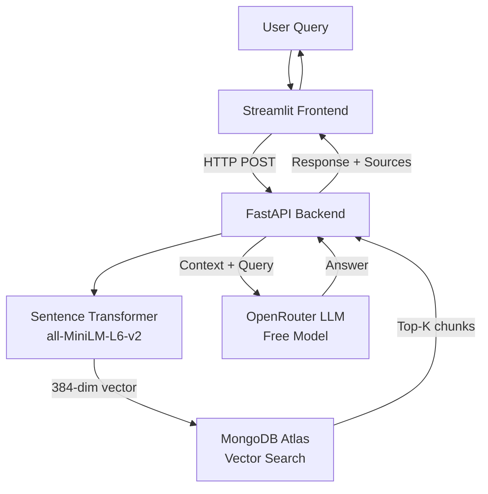

# YOLO Code Assistant

A RAG-based code assistant that helps developers understand the Ultralytics YOLO codebase through semantic search and AI-powered answers.


## Quick Start

### Prerequisites
- Python 3.9+
- MongoDB Atlas account (free tier)
- OpenRouter API key (free tier)

### Installation

```bash
# Clone and install
git clone <your-repo-url>
cd yolo-code-assistant/backend
pip install uv
uv venv && source .venv/bin/activate
uv pip install -e .

# Configure environment
cp .env.example .env
# Edit .env with your MongoDB URI and OpenRouter API key
```

### Setup

1. **Clone YOLO repository**
   ```bash
   git clone https://github.com/ultralytics/ultralytics.git
   ```

2. **Index the codebase**
   ```bash
   python scripts/setup_index.py
   # Enter path to ultralytics/ultralytics when prompted
   ```

3. **Create vector index in MongoDB Atlas**
   - Go to MongoDB Atlas → Database → Search Indexes
   - Create Search Index → JSON Editor
   - Use this configuration:
   ```json
   {
     "fields": [{
       "type": "vector",
       "path": "embedding",
       "numDimensions": 384,
       "similarity": "cosine"
     }]
   }
   ```
   - Name it: `code_vector_index`

4. **Run the application**
   ```bash
   # Terminal 1 - Backend
   cd backend 
   uvicorn src.main:app --reload
   
   # Terminal 2 - Frontend (From Backend Directry)
   streamlit run ../frontend/app.py
   ```

5. **Open browser**
   - Frontend: http://localhost:8501
   - API Docs: http://localhost:8000/docs

## Architecture



## Example Questions

**Training:**
- "How do I train a YOLOv8 model on a custom dataset?"
- "What data augmentation techniques are used during training?"

**Architecture:**
- "What's the difference between YOLOv8n and YOLOv8s models?"
- "How does Non-Maximum Suppression work in YOLO?"

**Export:**
- "How can I export a YOLO model to ONNX format?"

## Features

- **Semantic Search**: Finds relevant code even with different wording
- **Source Attribution**: Shows exact file paths and line numbers
- **Interactive Chat**: Natural conversation with message history
- **Adjustable Retrieval**: Control number of code chunks (1-10)
- **1,156 Indexed Chunks**: From models/, engine/, and data/ directories

## Documentation

- **[Design Decisions](Design.md)** - Technical deep dive, chunking strategy, model choices
- **[API Reference](http://localhost:8000/docs)** - FastAPI interactive documentation
- **[Backend README](backend/README.md)** - Detailed API and setup information

## Design Highlights

### Code Chunking
**Approach**: AST-based extraction of functions and classes

**Rationale**: Preserves semantic boundaries and maintains complete context, unlike fixed-size chunks that can split functions mid-code.

### Embedding Model
**Choice**: `all-MiniLM-L6-v2` (384 dimensions)

**Rationale**: Fast inference (~3000 sentences/sec), small footprint (80MB), no GPU required, excellent quality-to-speed ratio.

### LLM Selection
**Choice**: Free OpenRouter models (NVIDIA Nemotron, Qwen, Mistral)

**Rationale**: Strong code comprehension, 30B-80B parameters, free tier, reliable API, configurable via environment variable.

### Vector Database
**Choice**: MongoDB Atlas

**Rationale**: Free 512MB tier, native vector search, flexible schema, cloud-managed, good performance (~100ms search).

### Metadata Extracted
For each code chunk:
- `file_path`: Source location for references
- `name`: Function/class identifier
- `type`: function or class
- `code`: Full source code
- `docstring`: Documentation
- `lineno`: Line number for citations
- `embedding`: 384-dimensional vector

## Project Structure

```
yolo-code-assistant/
├── backend/
│   ├── src/
│   │   ├── config.py          # Configuration with logging
│   │   ├── embedder.py        # Sentence transformer wrapper
│   │   ├── indexer.py         # AST-based code parsing
│   │   ├── database.py        # MongoDB operations
│   │   ├── generator.py       # LLM response generation
│   │   └── main.py            # FastAPI app
│   ├── scripts/
│   │   └── setup_index.py     # One-time indexing script
│   ├── .env.example           # Environment template
│   └── pyproject.toml         # Dependencies
├── frontend/
│   └── app.py                 # Streamlit chat interface
├── Design.md                  # Technical documentation
└── README.md                  # This file
```

## Tech Stack

| Component | Technology | Purpose |
|-----------|-----------|---------|
| Backend | FastAPI | REST API server |
| Frontend | Streamlit | Chat interface |
| Embeddings | Sentence Transformers | Code → vectors |
| Vector DB | MongoDB Atlas | Semantic search |
| LLM | OpenRouter (free tier) | Answer generation |
| Parsing | Python AST | Code extraction |

## Future Improvements

### High Priority
1. **Hybrid Search** - Combine vector search with BM25 keyword matching for better recall
2. **Query Preprocessing** - Expand abbreviations (NMS → Non-Maximum Suppression)
3. **Caching** - Cache embeddings and common queries for 10x speedup

### Production Scaling
4. **Infrastructure** - Docker containerization, Kubernetes deployment
5. **Monitoring** - Prometheus metrics, error tracking with Sentry
6. **Performance** - Async processing, GPU acceleration for embeddings
7. **Quality** - User feedback loop, evaluation dataset

### Missing Features
- Multi-turn conversations with memory
- Code execution sandbox for testing
- Version-specific indexing (v8 vs v11)
- Authentication and rate limiting

## Troubleshooting

**Cannot connect to backend**
- Check FastAPI is running: http://localhost:8000/health
- Restart: `uvicorn src.main:app --reload`

**MongoDB connection failed**
- Verify `.env` has correct `MONGODB_URI`
- Check IP whitelist in Atlas (Network Access)

**Vector index not found**
- Create index in MongoDB Atlas UI
- Index name must be exactly: `code_vector_index`
- Wait for status "Active" (1-2 minutes)

**No code chunks found**
- Check path has double ultralytics: `backend/ultralytics/ultralytics/`
- Verify folders exist: `ls ultralytics/ultralytics/models`

## License

MIT License - See LICENSE file for details

**Note**: Ultralytics YOLO is licensed under AGPL-3.0. This project indexes and references the code without redistribution.

## Credits

Built with FastAPI, Streamlit, MongoDB Atlas, OpenRouter, and Sentence Transformers. Created for understanding the Ultralytics YOLO framework.
